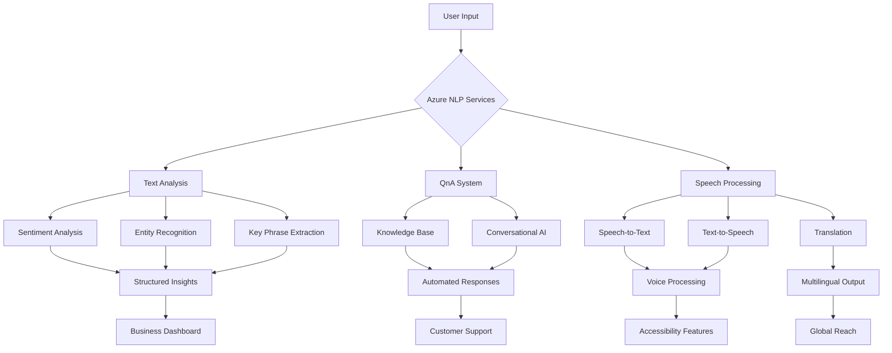

# End-to-End NLP Pipeline Using Azure Cognitive Services

## Project Overview
Built an AI-powered NLP system using Azure Cognitive Services that automates text and voice processing, delivers real-time insights, and enables conversational AI at scale.


## Tech Stack
| Component | Technology |
|-----------|------------|
| **Programming Language** | Python 3.10 |
| **Azure SDKs** | Azure AI Language SDK, Azure AI Speech SDK |
| **NLP Services** | Sentiment Analysis, Entity Recognition, QnA Maker, Translator |
| **Security** | dotenv for credential management |
| **Output Formats** | JSON logs, Annotated text, Conversational bot prototype |

## Features

### Text Analysis Application
> Automated sentiment analysis, entity recognition, and key phrase extraction from text data.

### Question Answering System
> Built a conversational AI that answers FAQs automatically using Azure QnA Maker.


## Results

### Performance Impact
- **5x faster** query handling with automated FAQs
- **Real-time insights** from unstructured text
- **Multilingual + voice support** for global accessibility
- **Scalable deployment** on Azure cloud

### Business Value
- **Faster customer support** with consistent responses
- **Reduced workload** for support teams
- **Global reach** with translation capabilities
- **Actionable insights** from text analytics

## Architecture



## 📁 Project Structure
```
azure-nlp-solutions/
├── src/
│   ├── text_analysis/
│   │   └── text-analysis.py
│   ├── conversational_ai/
│   │   └── qna-app.py
│   └── speech_processing/
│       ├── speech-to-text.py
│       └── text-to-speech.py
├── data/
│   ├── reviews/
│   ├── knowledge_base/
│   └── audio/
├── .env.example
├── requirements.txt
└── README.md
```

## Getting Started

### Prerequisites
- Azure subscription with:
  - Azure AI Language Service
  - Azure AI Speech Service
  - Azure QnA Maker
- Python 3.10+
- Azure CLI

### Installation
```bash
# Clone repository
git clone https://github.com/anasieze-ikenna/azure-nlp-solutions.git
cd azure-nlp-solutions

# Install dependencies
pip install -r requirements.txt

# Configure environment variables
cp .env.example .env
# Edit .env with your Azure credentials
```

### Running Applications
```bash
# Run text analysis
python src/text_analysis/text-analysis.py

# Run QnA application
python src/conversational_ai/qna-app.py

# Run speech processing
python src/speech_processing/speech-to-text.py
```

## Sample Output

### Text Analysis
```
File: customer_review.txt
Language: English
Sentiment: Positive
Key Phrases: excellent service, fast delivery, high quality
Entities:
    Google (Organization)
    Seattle (Location)
    John Moe (Person)
```

### QnA Response
```
Question: What is your return policy?
Answer: We offer a 30-day return policy for all unused products.
Confidence: 95%
Source: policy_document.pdf
```

## Skills Demonstrated
- **Azure AI Services**: Language, Speech, QnA, Translator
- **Cloud-Native Development**: Secure, scalable Azure deployments
- **NLP Implementation**: Sentiment analysis, entity recognition, conversational AI
- **Python Development**: Modular, production-ready code
- **Problem Solving**: Real-world business solutions

# Authored by
## Anasieze Ikenna - Cloud & AI Solutions Engineer
**Built with ❤️ using Azure Cognitive Services** | **Python 3.10** | **Production-Ready Architecture**

*Connect with me on [LinkedIn](https://www.linkedin.com/in/anasiezeikenna) for collaboration opportunities*
